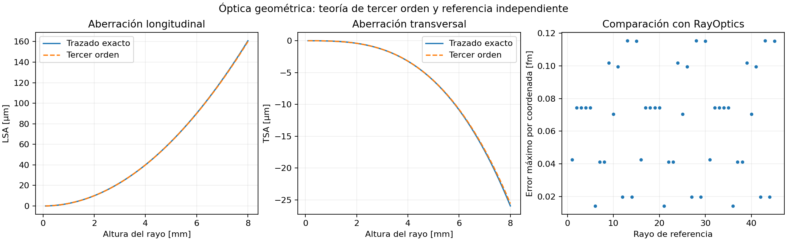
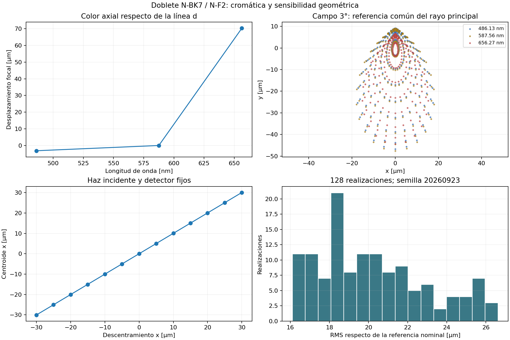
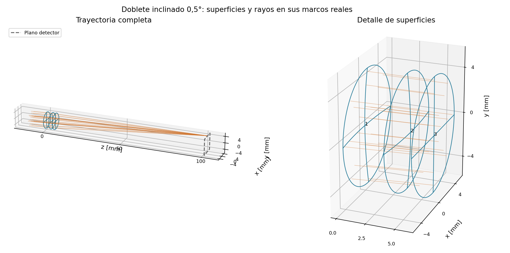

# geometrical-raytracer

Trazador de óptica geométrica en Python: propagación secuencial tridimensional,
conjugados paraxiales, pupilas, viñeteo y aberraciones de rayos.

El desarrollo actual se concentra en que la geometría y sus convenciones sean
explícitas, los resultados puedan contrastarse con la teoría y los proyectos
conserven su información al guardarlos. La optimización y la óptica ondulatoria
existentes quedan fuera de esta etapa de desarrollo y validación.

## Instalación

Python 3.11 o posterior:

```bash
pip install -e ".[dev]"
python -m pytest -q
```

El visor OpenGL es opcional: `pip install -e ".[gl]"`. Las diez pruebas del
núcleo no necesitan servidor gráfico ni RayOptics instalado.

## Primer análisis geométrico

Un espejo esférico permite comparar directamente el trazado exacto con la
aberración esférica de tercer orden:

```python
from raytracer.analysis.aberrations import geometric_aberrations
from raytracer.design import OpticalSystem, SurfaceRow
from raytracer.propagation import FieldPoint, PupilSampling, SequentialTracer, trace_pupil

system = OpticalSystem([
    SurfaceRow.mirror(radius=-100, thickness=-50, semidiameter=8, is_stop=True),
])
pupil = trace_pupil(
    SequentialTracer(system),
    FieldPoint.angle(),                  # haz paralelo: objeto en el infinito
    sampling=PupilSampling(kind="gauss", radial=10, azimuth=48),
)
report = geometric_aberrations(pupil, image_frame=system.image_frame)
print("RMS en el foco paraxial [mm]:", report.rms_radius_mm)
print("Desplazamiento al mejor foco [mm]:", report.best_focus_shift_mm)
print("RMS en el mejor foco [mm]:", report.best_focus_rms_mm)
print("Fracción geométrica transmitida:", report.geometric_throughput)
```

Para un objeto finito, fija `system.object_z` y usa `FieldPoint(x=..., y=...)`.
Las alturas se expresan en milímetros; `FieldPoint.angle(x_deg=..., y_deg=...)`
usa ángulos en grados. El muestreo predeterminado apunta cada rayo al diafragma
físico. La opción explícita `na_object_sine` conserva el muestreo angular anterior.

```bash
python -m examples.aberrations.geometrical_validation
```

Este ejemplo regenera una figura y un informe numérico con teoría de tercer
orden y 45 rayos de referencia calculados por RayOptics.



## Capacidades y alcance

| Área | Implementación actual |
|---|---|
| Propagación | Snell y reflexión vectoriales; diagnóstico por rayo de TIR, viñeteo, paralelismo, intersección inexistente, divergencia y recorrido hacia atrás |
| Superficies | Planos, esferas, cónicas, asferas de revolución y óvalos de Descartes; dominio geométrico explícito |
| Sistemas 3D | Marcos locales, descentramientos, inclinaciones, movimiento conjunto de superficies y plano detector orientable |
| Primer orden | ABCD con índices firmados para espejos; focal efectiva, foco posterior y conjugados reales o virtuales en sistemas centrados |
| Pupilas | Apuntado por lotes al diafragma circular o anular; campos finitos y angulares; cuadratura de Gauss por área |
| Aperturas | Circulares, anulares y rectangulares independientes de la forma refractora; diafragmas que conservan el medio |
| Aberraciones | Error transversal, centroide y RMS ponderados, intersección axial y mejor foco geométrico en el marco del detector |
| Cromática | Color axial paraxial; manchas 3D sobre detector común, pesos espectrales y de pupila, centroide y RMS policromáticos |
| Materiales | Procedencia, límites espectrales declarados y modelos aproximados identificados; contraste N-BK7/N-F2 con SCHOTT |
| Sensibilidad | Descentramientos, inclinaciones de grupos, espesor, radio e índice; diferencias a dos pasos y Monte Carlo reproducible |
| Informes y layout | JSON con prescripción, ajustes, versiones y huellas SHA-256; superficies y rayos en sus marcos 3D reales |
| Análisis axiales existentes | Abanicos, distorsión y Seidel; requieren un sistema centrado en coordenadas axiales |
| Persistencia | JSON versionado con materiales y coeficientes completos, aperturas, marcos y conjugados; CSV restringido a lo que puede representar |
| Motor ramificado | Propagación 2D existente; el puente desde sistemas secuenciales conserva los diafragmas circulares |

El trazado 3D no implica que todos los analizadores o visores existentes admitan
sistemas descentrados. Los constructores de layouts axiales y los análisis
clásicos tienen restricciones explícitas. El motor ramificado sigue siendo 2D.
El Newton de asferas generales comprueba el residuo, pero no garantiza encontrar
todas las intersecciones posibles de una superficie arbitraria.

## Sistemas colocados y persistencia

`row.placement` desplaza y gira una superficie respecto de su vértice nominal.
`system.frame` coloca el sistema completo en el espacio. `image_placement`
coloca el detector respecto del plano imagen nominal. Los puntos y direcciones
que devuelve el trazador están en coordenadas globales.

```python
from raytracer.math.transforms import RigidTransform

system.transform_surfaces(
    [0],
    RigidTransform.from_euler_xyz(origin=[0.1, 0, 0], angles_deg=[0, 2, 0]),
)
system.to_prescription("instrument.json", fmt="json")
restored = OpticalSystem.from_prescription("instrument.json", fmt="json")
```

Las longitudes geométricas y el camino óptico están en mm; la longitud de onda
del material está en µm. El camino óptico acumula `n × distancia firmada`.
Los segmentos internos hacia atrás requieren `allow_virtual_segments=True`;
úsalo cuando una prescripción incluya transferencias algebraicas a planos
auxiliares. El objeto virtual se habilita con `allow_virtual_object=True`.
El detector permite prolongaciones virtuales mediante `allow_virtual_image=True`.

## Cromática, sensibilidad y resultados reproducibles

```bash
python -m examples.aberrations.chromatic_sensitivity
```

El ejemplo construye un doblete N-BK7/N-F2 mediante ecuaciones analíticas,
compara el foco F/d/C, analiza descentramiento, inclinación e índice y guarda
128 realizaciones con semilla fija. Genera una prescripción reutilizable,
figuras y un [informe numérico completo](docs/chromatic_sensitivity_results.json).
La [guía de cromática y sensibilidad](docs/chromatic_sensitivity.md) especifica
pesos, detector, iluminación, unidades y límites de interpretación.





Los haces incidentes y el detector se mantienen fijos en sensibilidad. El
reenfoque opcional es un diagnóstico por campo, no un detector único que se
adapte simultáneamente a todos ellos. La transmisión es geométrica: no incluye
Fresnel ni absorción. Los resultados Monte Carlo describen las distribuciones
introducidas; no constituyen rendimiento de fabricación sin criterios de aceptación.

## Diez pruebas esenciales

La batería anterior se ha sustituido por **exactamente diez pruebas**, sin
parametrización ni exclusiones. Cada prueba reúne casos de una propiedad física
o de integridad del proyecto:

1. Snell, reflexión, reciprocidad, TIR, Fresnel y camino óptico de una lámina.
2. Intersecciones analíticas, dominio de una esfera y diagnósticos del recorrido.
3. Lente gruesa, conjugados, dispersión SCHOTT y cromática ponderada de una lámina.
4. Focos exactos de parábola/elipse y camino óptico del óvalo de Descartes.
5. Aperturas, conservación del medio, cuadratura y viñeteo ponderado.
6. Invariancia 3D, espejo plegado, sensibilidad analítica y Monte Carlo reproducible.
7. Apuntado a pupila para campos finitos/infinitos y simetría del cono angular.
8. Aberración esférica y mejor foco contrastado con un nuevo trazado al detector.
9. Persistencia de geometría y materiales; informes trazables y formatos incompatibles.
10. Intersecciones, dirección de salida y camino óptico de 45 rayos de RayOptics.

La [guía de validación](docs/geometrical_validation.md) explica ecuaciones,
tolerancias, independencia de las referencias y limitaciones. GitHub Actions
configura esta misma batería en Linux, Windows y macOS con Python 3.11–3.13.
Eso no sustituye la comprobación de los resultados de cada ejecución de CI.

## Organización y próximos pasos

- `math`, `surfaces`, `optics`: geometría, perfiles, leyes y materiales.
- `design`, `propagation`, `io`: prescripciones, trazado y persistencia.
- `analysis`, `viz`: medidas y presentación.
- `tests/reference`: resultados externos versionados; `reference`: regeneración.
- `examples`, `data`, `docs`: ejemplos, prescripciones y documentación.

Para la siguiente etapa: definición y validación completa de coeficientes de
Seidel por superficie; curvatura de campo tangencial/sagital y distorsión frente
a referencias independientes; pupilas de entrada/salida y telecentricidad;
ampliación del catálogo con datos primarios verificados; sensibilidad con
correlaciones y criterios de aceptación; interfaz de edición y diagnóstico 3D.
Los ejemplos y notebooks históricos se conservan como material de trabajo:
sus cifras anteriores no se consideran revalidadas por estas diez pruebas.
