# raytracer

Trazador de rayos óptico en Python. Propaga luz **exactamente** —resolviendo
la ecuación de cada superficie, sin aproximación paraxial— a través de
sistemas ópticos reales, y mide lo que sale: aberraciones, distorsión,
frente de onda, PSF, formación de imagen.

**12.000 líneas · 9 paquetes en cadena estricta · 224 tests contra verdades
analíticas · dos objetivos de patente replicados dígito a dígito · lentes
estigmáticas y aplanáticas por superficies de Descartes, con optimizador de
restricciones enchufables y materiales reales**

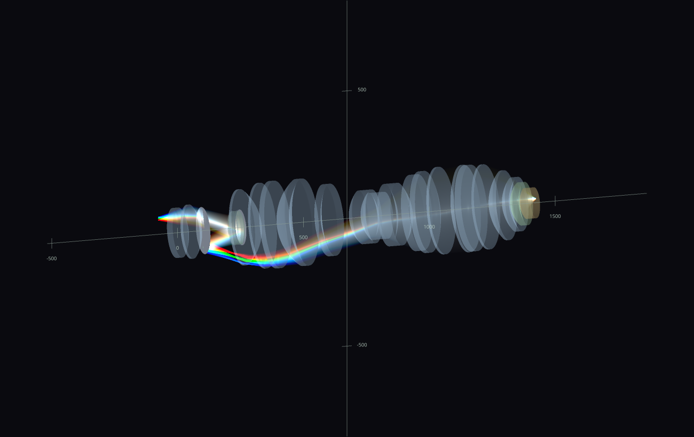

Arriba: el objetivo litográfico DUV de la patente US 7,557,996 —48
superficies, 12 asféricas, NA 1.2 en inmersión— recorrido por tres haces de
distinta longitud de onda. Se separan en el camino catadióptrico plegado y
vuelven a sumarse a blanco en la imagen. Lo dibuja el visor OpenGL, que
acumula los rayos aditivamente en un framebuffer de coma flotante: donde se
superponen miles de rayos la intensidad *suma*, y un tone-mapping
auto-expuesto revela la estructura del haz dentro del rango dinámico.

## Qué hace

Dado un sistema óptico —una prescripción de superficies, o un puñado de
lentes y espejos colocados en el espacio— el paquete responde a tres tipos
de pregunta.

**¿Por dónde va la luz?** Cada rayo se intersecta con cada superficie
resolviendo la ecuación de esa superficie. Para una cónica hay forma
cerrada; para un perfil asférico, Newton sobre `f_Σ(A + λu) = 0` desde una
semilla que aporta la propia superficie; para el resto, un barrido con
bracket-and-bisect. La refracción y la reflexión se aplican en forma
vectorial completa, y la reflexión total interna se detecta rayo a rayo.

**¿Qué tan bien forma imagen?** Spot diagrams ponderados por área de pupila,
ray fans transversales, distorsión por rayo principal (la convención de
Zemax/OpticStudio), coeficientes de Seidel deducidos del frente de onda
real, expansión de Zernike ANSI/OSA, aberración cromática axial y lateral,
frente de onda por eikonal, PSF escalar e imagen aérea parcialmente
coherente por el método de Abbe.

**¿Cómo se ve?** Dos backends sobre una misma escena: figuras matplotlib
para el análisis, y el visor OpenGL HDR para el trazado. La escena es una
lista de ítems neutrales —segmentos de rayo, perfiles de superficie,
cuerpos de lente, pantallas, marcadores— y cada backend la consume entera.

## Los dos motores de propagación

Los dos motores se distinguen por lo que hace un rayo al llegar a una
superficie.

**Secuencial** — cada rayo atraviesa cada superficie en orden fijo, un solo
camino determinista. Es el modelo de diseño óptico clásico, y el orden fijo
es lo que permite vectorizar: los N rayos avanzan juntos en numpy, con un
`TraceStatus` por rayo que marca fallo de intersección, TIR o viñeteo. Sobre
él se apoyan la capa paraxial (matrices ABCD, recuperación de conjugados),
la resolución del rayo principal y el muestreo de pupila.

**Ramificado** — en cada colisión el rayo se divide en su hijo reflejado *y*
su hijo refractado, y el recorrido en anchura genera el árbol completo. Con
él se ven las cáusticas, la luz parásita y las reflexiones múltiples. Lleva
OPL e intensidad acumuladas, con división de Fresnel opcional.

```python
from pathlib import Path
from raytracer.design import OpticalSystem
from raytracer.propagation import (
    SequentialTracer, FieldPoint, PupilSampling, solve_object_plane, trace_pupil,
)
from raytracer.analysis import spot_data

system = OpticalSystem.from_prescription(
    Path("data/optical_systems/lithography/US7557996_Fig3_Table3_prescription.csv")
)
tracer = SequentialTracer(system)
solve_object_plane(tracer)          # recupera el plano objeto imponiendo B = 0

pupil = trace_pupil(tracer, FieldPoint(y=62.0), na_object_sine=0.3,
                    sampling=PupilSampling(kind="rings", radial=12, azimuth=72))
print(spot_data(pupil).rms_radius_um)        # 0.087 µm
```

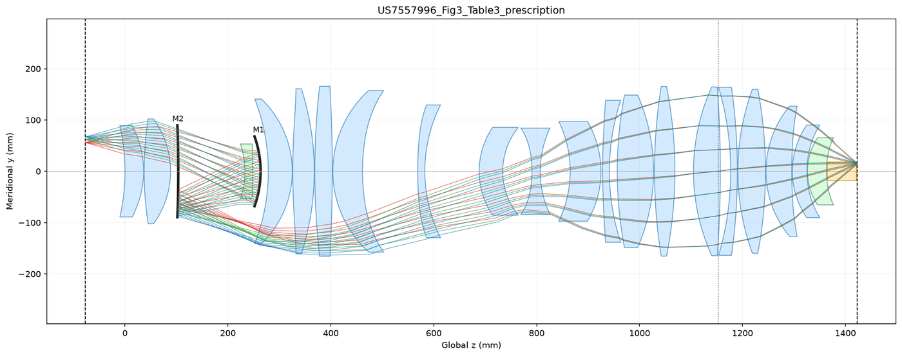

El trazado sigue el camino catadióptrico plegado: los dos espejos (M1, M2)
devuelven el haz sobre sí mismo antes del grupo de inmersión final.

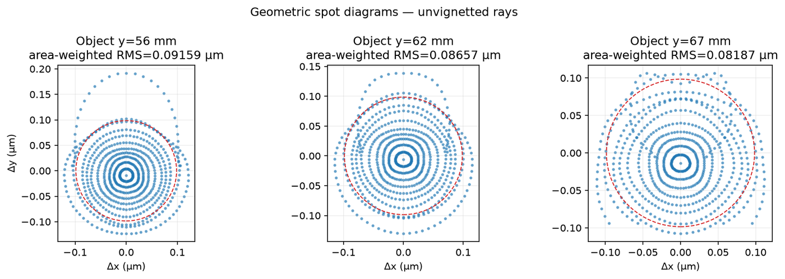

Spots recentrados en el centroide ponderado por área de pupila, con el primer
cero de Airy como referencia: los tres campos quedan por debajo del límite de
difracción.

Y el corte meridional del mismo trazado, con acumulación HDR: 363 rayos
exactos llenando la apertura, terminando sobre una pantalla de observación
dibujada en el plano imagen.

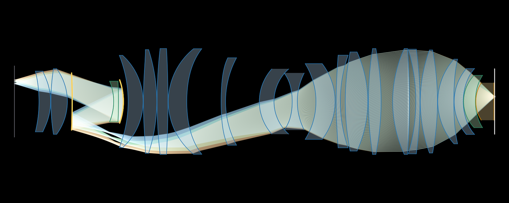

## El mapa objeto → imagen

Un sistema ideal manda cada punto objeto a `magnificación × objeto`. La
distorsión es la desviación del mapa real respecto de esa recta.
`distortion_grid` la mide trazando una malla cuadrada de puntos de campo,
uno por rayo principal —el rayo que pasa por el centro del diafragma, la
referencia estándar, inmune al coma y al viñeteo que arrastran el centroide
de un spot—, y devuelve dónde aterriza cada punto en el plano imagen.

```python
from pathlib import Path

import numpy as np
from raytracer.analysis import distortion_grid
from raytracer.design import OpticalSystem
from raytracer.propagation import SequentialTracer, solve_object_plane
from raytracer.viz import plots

tracer = SequentialTracer(
    OpticalSystem.from_prescription(Path("data/optical_systems/photographic/cooke_triplet_prescription.csv"))
)
conjugate = solve_object_plane(tracer)
half = abs(conjugate.object_z) * np.tan(np.deg2rad(10.0))   # ±10° de semicampo

grid = distortion_grid(tracer, magnification=conjugate.magnification,
                       half_field=half, n=11)

print(grid.valid_fraction)                     # 1.0  -- 121/121 sin viñetear
print(grid.max_distortion_um)                  # 25.81  (µm)
print(grid.max_relative_distortion_percent)    # 0.2074 (% de la altura de imagen)

plots.distortion_grid_figure(grid, exaggeration=25.0)
```

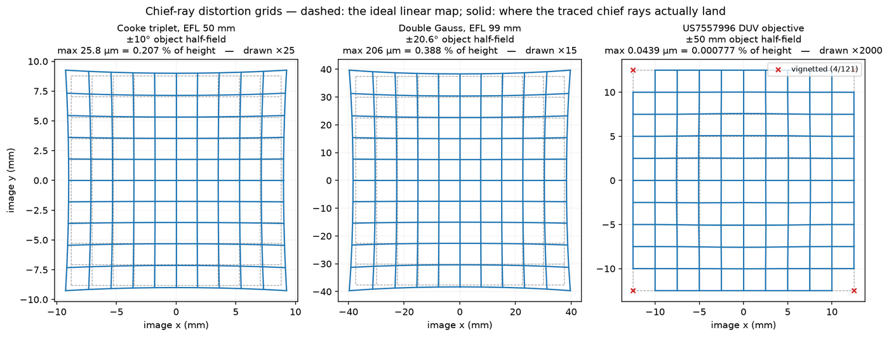

Cada panel superpone dos mallas: la ideal, en gris discontinuo, y la
trazada, en azul. El dial `exaggeration` amplifica la desviación de cada
punto alrededor de su posición ideal, y cada panel usa el suyo: entre el
Doble Gauss y el objetivo DUV hay un factor 4700 en desviación máxima, y un
multiplicador común dejaría dos paneles ilegibles. El título de cada panel
lleva la magnitud verdadera, sin amplificar.

El triplete Cooke y el Doble Gauss dibujan corsé (**pincushion**): la
desviación radial es positiva en todo el campo y crece con él, hasta 25,8 µm
y 206 µm en la esquina — 0,207 % y 0,388 % de la altura de imagen.

El objetivo DUV, a ×2000, muestra el residuo de un diseño ya corregido: la
desviación llega a +43,9 nm hacia r ≈ 5,6 mm (7,8 partes por millón, el
máximo relativo), cruza el cero cerca de r ≈ 11,5 mm y termina en −2,2 nm en
las esquinas del campo. El signo cambia dentro del campo, que es la firma de
una distorsión balanceada en el diseño, y todo ello sobre un campo imagen de
25 mm de diámetro.

Las cuatro esquinas marcadas con una `x` roja son puntos cuyo rayo principal
vieta: la malla llega a 50 mm de semicampo objeto, y sus esquinas quedan a
50·√2 = 70,7 mm, más allá del radio útil de ~68 mm del diseño. Esos puntos
quedan como `NaN`, rompen la línea que atravesarían y quedan contados en
`grid.valid_fraction`.

Para la curva clásica de distorsión contra campo, `chief_ray_distortion`
hace el barrido 1-D con un solo rayo principal por punto, en mm de altura
objeto o en grados de campo.

## Superficies

Una superficie declara su propia geometría de una de dos formas —
**implícita** (`f_Σ(x) = 0` y `∇f_Σ`) o **paramétrica** (`x = P(t)` y una
semilla) — y con eso ya es intersectable. La intersección se resuelve una
sola vez, genéricamente, en `math.intersections`.

Vienen definidas la esfera/cónica/asférica de revolución, el segmento recto,
las cónicas en forma polar (elipse, círculo, parábola, hipérbola) y el óvalo
de Descartes. Añadir una superficie nueva es escribir su `f_Σ` y su
gradiente; la intersección, la normal y el recorte de apertura salen gratis.

### El caso que lo pone a prueba

El **óvalo de Descartes** es la superficie refractante construida para ser
perfectamente estigmática entre dos puntos conjugados. Es una superficie
concreta, con forma cerrada, y el trazador la resuelve exacta.

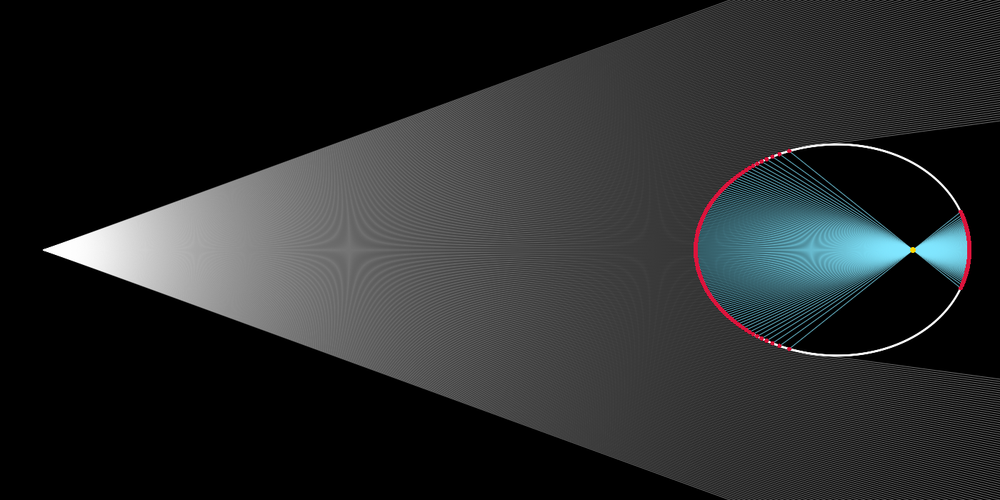

Comparada con una esfera de la **misma curvatura de vértice**, entre los
**mismos conjugados** y a la misma apertura:

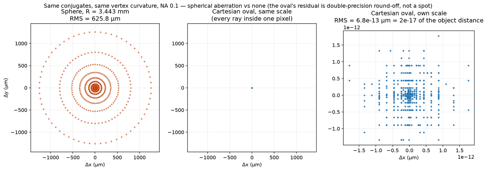

La esfera deja 625,8 µm RMS de aberración esférica. El óvalo deja
6,8e-13 µm, que es el suelo de la precisión de doble: 2e-17 de la distancia
objeto. El paquete *verifica* el estigmatismo, y los ejemplos imprimen el
número.

En 3-D, el mismo óvalo revuelto y recorrido por un haz denso:

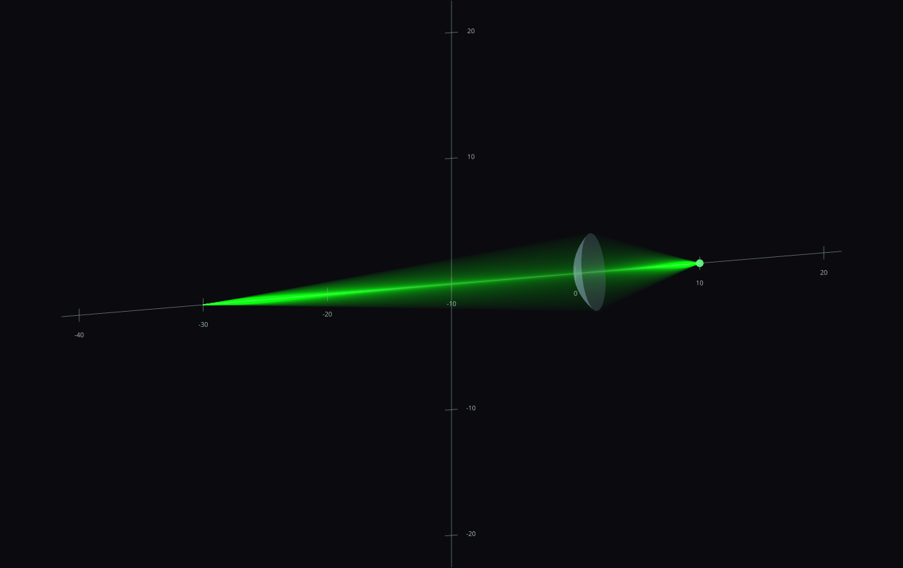

## Lentes estigmáticas y aplanatismo

Un óvalo de Descartes es estigmático para *un* par de conjugados. Encadenar
N de ellos, de modo que la imagen de cada superficie sea el objeto de la
siguiente, produce una **lente ovoide estigmática** (SOL, *stigmatic ovoid
lens*): libre de aberración esférica a cualquier apertura, sin aproximación
paraxial en ninguna parte. Para conjugados extremos fijos, las conjugadas
intermedias quedan libres — toda elección es estigmática, y esa libertad es
la moneda con que se compra la segunda propiedad: el **aplanatismo**, la
condición del seno de Abbe, que elimina también el coma.

La teoría es la de Silva-Lora & Torres: por cada superficie, la normal en el
punto de impacto cruza el eje a una distancia `V_k C_k` del vértice, con
forma cerrada en los parámetros GOTS (su Ec. 24); el cociente de senos
factoriza sobre las superficies como `sin u₀ / sin u_N = (n_N/n₀) · g_t · M`,
y el sistema es aplanático exactamente cuando el mapa `M ≡ 1` para todo rayo
(Ec. 25). El paquete implementa las dos rutas — la forma cerrada evaluada en
los puntos de impacto trazados, y el cociente de senos medido sobre los
rayos exactos — y los tests exigen que coincidan a 1e-9 por rayo.

```python
from raytracer.design import StigmaticTrain
from raytracer.analysis import aplanatism_report, aplanatic_image_surface
from raytracer.optimize import optimize_aplanat

# La familia: tres vidrios cementados, 4 superficies de Descartes,
# conjugados -100 -> +90. Estigmática para cualquier (d1, d2, d3).
train = StigmaticTrain(
    media=(1.0, 1.517122, 1.670591, 1.851280, 1.0),   # aire y tres vidrios
    vertices=(0.0, 15.0, 25.0, 35.0),
    conjugates=(-100.0, -150.0, -600.0, 450.0, 90.0),
    semidiameter=10.0,
)
print(aplanatism_report(train, na_object_sine=0.195).map_rms)   # 3.2e-03

fit = optimize_aplanat(train, na_object_sine=0.195, samples=21,
                       bounds=(-3000, 3000), diff_step=1e-4,
                       xtol=1e-14, ftol=1e-14, gtol=1e-14)
print(fit.after.map_rms)                                        # 3.1e-06
```

Hay un aplanático **exacto** con solo dos superficies: el singlete Omega
simétrico (`StigmaticTrain.symmetric_singlet`), con la conjugada intermedia
en el centro de la lente. Por simetría especular cada rayo sale con el seno
con que entró, y `M = 1` queda en 2e-16 — precisión de máquina, verificado
por trazado. Su firma se ve en el desenfoque fuera de eje: el blur del
singlete estigmático crece *lineal* con el campo (coma), el del aplanático
crece *cuadrático* (el coma se fue, queda astigmatismo). Medido: cocientes
2.00 y 4.00 exactos al duplicar el campo.

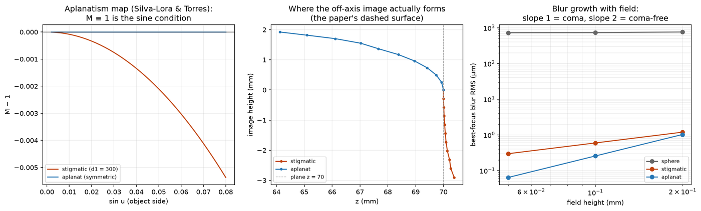

El panel central muestra **la superficie donde se forma la imagen
aplanática** — la línea discontinua de las figuras del artículo —
localizada trazando un cono desde cada punto objeto desplazado y reduciendo
el haz emergente a su punto de mínimos cuadrados (`aplanatic_image_surface`).
El aplanatismo no la aplana: el singlete simétrico es aplanático exacto con
7,8 mm de sagita en 3 mm de campo. Aplanarla es una restricción adicional
que el optimizador acepta como término de campo plano (`flat_field_weight`),
y el experimento del ejemplo la recorre por número de superficies:

| N superficies | (M−1)_RMS | sagita máx (campo 3 mm) |
|---|---|---|
| 2 (aplanático exacto, sin libertad) | 1.7e-16 | 7.77 mm |
| 4 (cementado, peso de campo plano) | 2.9e-04 | 0.0000 mm |
| 6 (triplete en aire, peso de campo plano) | 7.9e-06 | 0.0001 mm |

Con 3 grados de libertad (N=4) se compra aplanatismo *o* campo plano; con 5
(N=6) alcanza para los dos: el mínimo en superficies que logra **aplanatismo
en un plano**, bajo las tolerancias del ejemplo, es 6. Las conjugadas
intermedias infinitas declaran espacios colimados y son estructurales — el
optimizador no las toca — y una superficie con sus dos conjugadas vecinas en
infinito degenera exactamente en un **plano**: así entra una cara plana,
fabricable, en un tren exactamente estigmático.

La construcción en dos superficies sigue la abstracción Ω (`OmegaLens`) del
[generador de STL de superficies cartesianas](https://github.com/blancusjh/cartesian-surfaces-stl-generator)
del autor; aquí la misma lente queda lista para el trazador secuencial.

**Fuentes.** A. Silva-Lora y R. Torres, *Aplanatism in stigmatic optical
systems*, J. Opt. Soc. Am. A 37 (2020); *Superconical aplanatic ovoid
singlet lenses*, J. Opt. Soc. Am. A 37, 1155–1165 (2020); *Explicit
Cartesian oval as a superconic surface for stigmatic imaging optical systems
with real or virtual source or image*, Proc. R. Soc. A 476, 20190894 (2020).
La parametrización GOTS de `raytracer.surfaces.cartesian_oval` transcribe la
del segundo artículo; `raytracer.analysis.aberrations.aplanatism` implementa
las Ecs. (24)–(31) del primero.

## La ontología del paquete

Los paquetes están cortados por la **naturaleza** de cada pieza, y las
dependencias forman una cadena estrictamente descendente. Cada import a
nivel de módulo apunta a un paquete anterior en el orden:

```
math → surfaces → optics → design → propagation → io → analysis → optimize → viz
```

Esas son las aristas reales del grafo, leídas del AST de cada módulo:

| paquete | importa a nivel de módulo | líneas |
|---|---|---|
| **`math`** | — | 463 |
| **`surfaces`** | `math` | 1157 |
| **`optics`** | `math`, `surfaces` | 973 |
| **`design`** | `surfaces`, `optics` | 727 |
| **`propagation`** | `math`, `surfaces`, `optics`, `design` | 1094 |
| **`io`** | `surfaces`, `optics`, `design` | 424 |
| **`analysis`** | `design`, `propagation` | 2302 |
| **`optimize`** | `design`, `analysis` | 563 |
| **`viz`** | `surfaces`, `optics`, `design`, `propagation`, `analysis` | 4123 |

`tests/test_architecture.py` recorre el AST de cada módulo y lo comprueba, de
modo que la cadena es una afirmación verificada en cada `pytest`.

### Qué es cada parte

**`math` — geometría sin óptica.** Vectores y normalización,
transformaciones rígidas (`RigidTransform`), y los solvers de intersección
rayo/superficie. Aquí vive la aritmética que valdría igual para cualquier
trazado geométrico: el paquete entero desconoce qué es un índice de
refracción.

**`surfaces` — las formas que un rayo puede encontrar.** Una superficie es
la frontera entre dos medios: posee su forma, su marco local, su apertura
libre y los índices a cada lado. Declara cómo describirse a sí misma
(implícita o paramétrica) y ahí termina su responsabilidad. `Surface.hit()`
es una plantilla genérica que sirve a todas.

**`optics` — la luz y las leyes que obedece.** `Ray` (origen, dirección,
longitud de onda, `point_at`), `laws` (reflexión y refracción vectoriales,
en versión escalar y por lotes), `radiometry` (coeficientes de Fresnel s y
p), `materials` (índice constante, Abbe, Sellmeier medido, y un catálogo de
vidrios), `sources` (puntual, paralela, de imagen), `instruments` (una
pantalla es un instrumento, que es una superficie) y `elements` (`Lens`,
`Mirror` ya montados).

**`design` — el modelo de datos de un sistema.** `SurfaceRow` es una fila de
prescripción: radio, espesor al siguiente, material, semidiámetro, constante
cónica, coeficientes asféricos, tipo de superficie. `OpticalSystem` es la
secuencia completa, con los vértices acumulados, los índices a cada lado de
cada superficie, el índice del diafragma y los planos objeto e imagen.
`StigmaticTrain` es la familia paramétrica de lentes ovoides estigmáticas
(ver abajo), declarada como lo que ontológicamente es: **medios que llenan
el espacio, superficies que los delimitan** — `media=(aire, vidrio, aire)`,
donde cada medio es un `Material` a la fidelidad que haga falta: el medio
de índice constante (`ConstantIndex`; un float basta) o una ley de
dispersión real, con las formas construidas del índice principal en la
longitud de onda de diseño. Los espejos son superficies puras (no
delimitan medio nuevo). Describe **qué es** un sistema y contiene cero
lógica de propagación: un diseño existe antes de que exista un motor que
lo trace.

**`propagation` — los algoritmos.** El único lugar que gobierna qué hace un
rayo después de chocar. `sequential` vectoriza N rayos por M superficies en
orden fijo; `branching` construye el árbol de reflejados y refractados;
`paraxial` aporta `ParaxialModel`, `solve_object_plane` (recupera el plano
objeto imponiendo B = 0 en la matriz del sistema) y `differential_conjugates`;
`fields` aporta `FieldPoint`, el solver 2-D del rayo principal
(`chief_ray_slopes`), el muestreo de pupila y `trace_pupil`. Estas dos
últimas viven aquí porque resolver un rayo principal es trazar.

**`io` — serialización.** Lectura y escritura de prescripciones, con los
formatos en un registro (`FORMAT_READERS`, `FORMAT_WRITERS`), y catálogos de
materiales como archivos de datos (`read_materials`: modelos constant /
abbe / cauchy / sellmeier por fila de CSV — así entra la resina de
impresión de `data/materials/formlabs_resins.csv`). El formato de archivo es una
naturaleza distinta de lo que un sistema es.

**`analysis` — lo que se mide sobre un sistema ya trazado.** Partido en dos
por el objeto de la medida: `imaging` mira la imagen (spots, PSF escalar,
imagen aérea de Abbe, contraste) y `aberrations` mira el error de rayo y de
frente de onda (métricas de campo, distorsión, Seidel, cromática, eikonal,
Zernike, ray fans, estigmatismo, aplanatismo). Los dos re-exportan desde
`raytracer.analysis`, derivando la lista de sus propios `__all__`.

**`optimize` — mover parámetros.** Todo lo anterior a este paquete mide;
este varía. Su rasgo distintivo es *qué* varía: no coeficientes de una
superficie ajustándose a una forma, sino las conjugadas libres de familias
cuyos miembros ya son todos exactos en un sentido (estigmáticos), gastando
esa libertad en comprar más propiedades. Las propiedades son **restricciones
enchufables** (`constraints.py`): `Aplanatism`, `Distortion`,
`FlatImageSurface`, `TargetMagnification`, `AxialColor` — cada una un objeto
que produce su bloque de residuales sobre trazas compartidas en caché, y
cualquier lista de ellas forma el objetivo de `optimize_train`. Una
restricción nueva es una subclase de `Constraint` con `size` y `residuals`.

**`viz` — presentación.** `plots` para las figuras matplotlib, `bodies`
para los cuerpos de lente deducidos de la secuencia de medios — qué par de
superficies encierra qué medio se *deduce* de la descripción estándar
(aire → Σ1 → vidrio → Σ2 → aire), el contorno se cierra en la intersección
de las caras cuando se cruzan bajo la apertura (la unión Ω del generador de
STL del autor) y cada cuerpo se colorea por densidad óptica: a mayor
índice, azul más oscuro, automáticamente —, `scene` para la escena neutral
de ítems, `gl/` para el visor OpenGL (cámara, shaders, renderers, ventana)
e `interactive` para arrastrar fuente, lente y pantalla en vivo. Es el
paquete más grande y el único del que nada depende.

### Tres decisiones que explican el resto

**Una sola entrada para intersectar.** Un rayo es `A + λu`. Una superficie
se describe implícita o paramétricamente, y cada forma da un método:
resolver `f_Σ(A + λu) = 0`, o resolver `A + λu = P(t)`, en ambos casos para
la menor λ positiva. `intersect_ray_with_surface(rayo, superficie)` pregunta
a la superficie qué ofrece y aplica el método. Dentro del implícito, el
solver toma la ruta exacta más barata que la superficie permita: forma
cerrada si `f_Σ` es cuadrática, Newton si la superficie da semilla,
bracket-and-bisect en el caso general. Las tres resuelven *la misma
ecuación*.

**El gradiente implícito hace doble trabajo.** `∇f_Σ` es a la vez la
derivada que necesita Newton y la normal de la superficie. Declarar `f_Σ` y
su gradiente compra intersección y normales de una vez, y por eso
`Surface.hit()` es una única plantilla genérica.

**Un rayo lleva su estado y nada más.** `Ray` es origen, dirección,
longitud de onda y `point_at()`. Detectar la colisión corresponde a la
descripción de la superficie; decidir qué pasa después corresponde al
algoritmo de propagación; la genealogía de rayos pertenece al algoritmo que
la crea.

Las dos únicas aristas que cruzan la cadena hacia arriba están diferidas a
propósito, y el test las fija: `OpticalSystem.from_prescription` alcanza el
registro de lectores de `io` desde dentro del método, de modo que el modelo
de datos sigue sin depender de ningún formato de archivo; y
`surfaces/surface.py` anota un `Ray` bajo `if TYPE_CHECKING`, que se borra
en tiempo de ejecución, de modo que una superficie es intersectable sin
saber qué es un rayo.

## Instalación

```bash
pip install -e .          # numpy, scipy, matplotlib
pip install -e ".[gl]"    # + vispy y un backend de ventana, para el visor OpenGL
```

## Ejemplos

```bash
python -m examples.lithography.duv_objective_3d --spectrum   # la imagen de arriba
python -m examples.lithography.duv_objective_2d              # el mismo objetivo, HDR 2-D
python -m examples.stigmatic_surfaces.ellipse_mirror
python -m examples.stigmatic_surfaces.cartesian_oval_refractor_2d
python -m examples.stigmatic_surfaces.cartesian_oval_refractor_3d --beam
python -m examples.stigmatic_surfaces.aplanatic_sol            # esfera vs estigmática vs aplanática
python -m examples.telescopes.keplerian                      # y galilean, newtonian
python -m examples.imaging.single_lens_relay                 # matplotlib y OpenGL
python -m examples.imaging.interactive_doublet               # arrastra fuente/lente/pantalla
python -m examples.imaging.geometric_and_diffractive_imaging
```

Todos aceptan `--save salida.png` para renderizar sin abrir ventana;
`docs/render_images.py` regenera con eso las imágenes de este README.

Cada ejemplo verifica su propia afirmación e imprime el número. El espejo
elíptico mide la distancia de cada rayo reflejado al foco lejano
(5,1e-13 µm RMS); el newtoniano comprueba que el plegado exacto a 90°
conserva el foco (1,5e-15); los telescopios *resuelven* la separación que
hace infinita la focal efectiva en el sistema real de espesor finito, y
luego confirman por trazado que dos rayos paralelos salen paralelos.

| | |
|---|---|
| 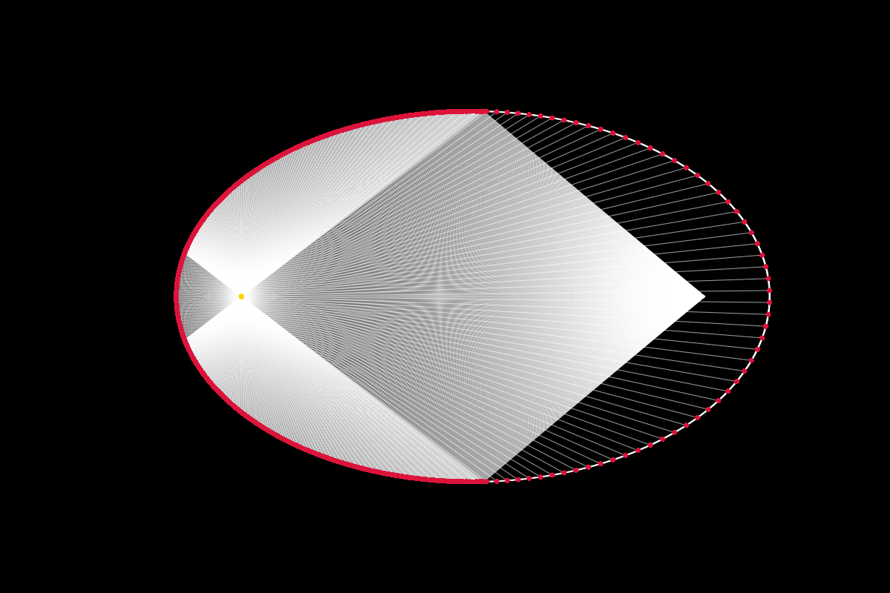 | 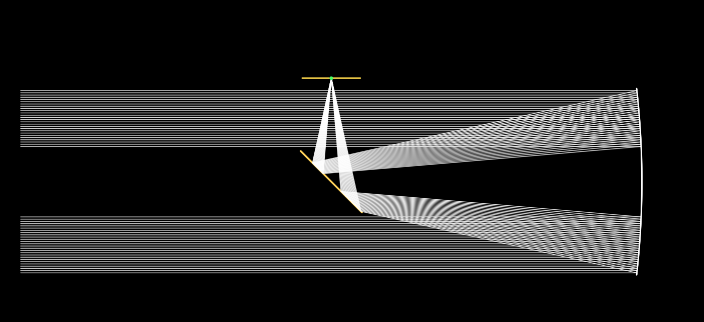 |
| **Espejo elíptico** — todo rayo que sale de un foco pasa por el otro. | **Newtoniano** — primario parabólico, secundario plano a 45°, haz anular con obstrucción central. |
| 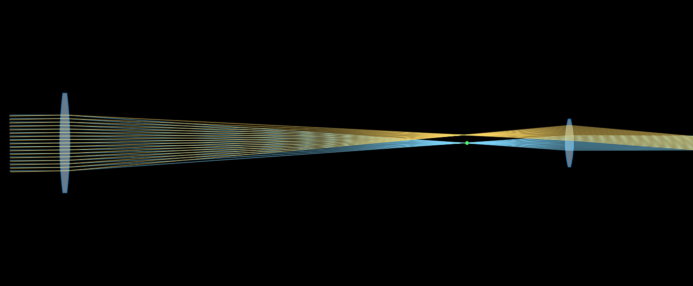 | 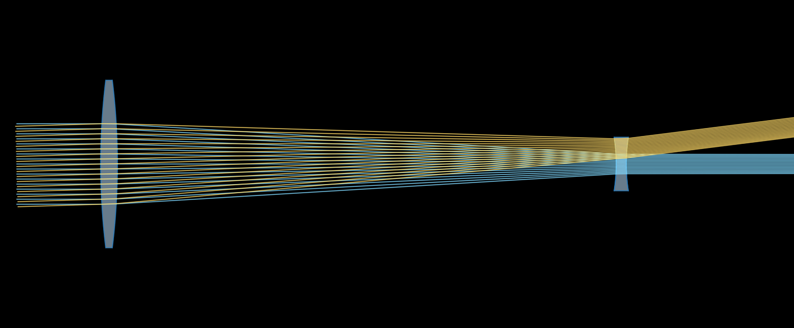 |
| **Kepleriano** — imagen intermedia real (punto verde). **−3,989×**, invertida. | **Galileano** — ocular negativo, tubo corto. **+4,069×**, derecha. |

Los notebooks en `examples/notebooks/` reproducen dos objetivos de patente
completos: `us7557996_objective.ipynb` (el DUV de inmersión, réplica dígito a
dígito del análisis de referencia) y `euv_six_mirror.ipynb` (objetivo EUV de
seis espejos, US 7,151,592, NA 0.22, λ=13.4 nm — con refit de asféricas por
mínimos cuadrados, frente de onda por eikonal e imagen de Abbe). Los dos
incluyen su malla de distorsión, la del EUV centrada en su campo anular de
trabajo, a 120 mm del eje. `stigmatism_and_aplanatism.ipynb` recorre completa
la sección de aplanatismo: los tres singletes, el mapa `M`, la superficie
imagen aplanática, la optimización del triplete cementado, las mallas de
distorsión de los tres SOL (7,2 % → 0,085 % → 0,002 %), abanicos de rayos,
métricas de campo y la tabla de Seidel que separa esfera, estigmático y
aplanático. `building_optical_systems.ipynb` construye cuatro sistemas
potentes de solo lentes y aire con vidrios reales del catálogo Sellmeier —
objetivo de telescopio acromático de 2 lentes (blur 1,5 µm contra 5,5 µm de
Airy), microscopio 20×/NA 0.25 de 3 lentes con campo plano y 0,1 % de
distorsión, ultra-gran-angular de objeto virtual (estigmático exacto a ±55°)
y proyector de 4 lentes — cada uno optimizado con las restricciones
enchufables (`Aplanatism`, `Distortion`, `FlatImageSurface`,
`TargetMagnification`, `AxialColor`), y cierra con el microscopio
imprimible: tres lentes de resina Formlabs Clear V4, con su dispersión
medida leída de `data/materials/formlabs_resins.csv` y su color axial declarado
(la búsqueda multiarranque vive en `docs/design_systems.py`).

## Tests

```bash
pytest                                    # 220 tests
xvfb-run -a pytest                        # 224, incluidos los de contexto OpenGL
```

Las verdades de referencia son analíticas donde existen: conjugados de
parábola y elipsoide a precisión de máquina, magnificación paraxial del
objetivo DUV (+0.2500000135), NA de imagen 1.1977, RMS de Zernike (0.5089 nm
tras quitar tilt y desenfoque), primer cero de Airy, colapso de contraste en
el límite de coherencia parcial, y linealidad aditiva del framebuffer HDR.
Los dos métodos de intersección se contrastan entre sí sobre el óvalo de
Descartes —la única superficie que ofrece ambas descripciones— exigiendo que
caigan en el mismo punto para el mismo rayo. La Ec. (24) del artículo de
aplanatismo se contrasta con la construcción geométrica de la normal, y el
mapa `M` con el cociente de senos de los rayos exactos, a 1e-9 por rayo; el
singlete simétrico ancla el caso `M ≡ 1` a precisión de máquina. La cadena
de dependencias entre paquetes se comprueba leyendo el AST de cada módulo.

## Estructura del repositorio

```
raytracer/     el paquete
data/          datos puros, organizados por naturaleza:
  materials/         catálogos de materiales (formlabs_resins.csv)
  optical_systems/   prescripciones y diseños por clase de sistema:
    lithography/ photographic/ elements/          (prescripciones CSV)
    telescopes/ microscopes/ projectors/ ultrawide/  (trenes JSON)
examples/      demos ejecutables por categoría + notebooks de réplica de patentes
docs/          imágenes del README, el script que las regenera y las búsquedas de diseño
reference/     notebooks y módulo de referencia originales
tests/         verdades analíticas + regresiones de sistema completo
```
