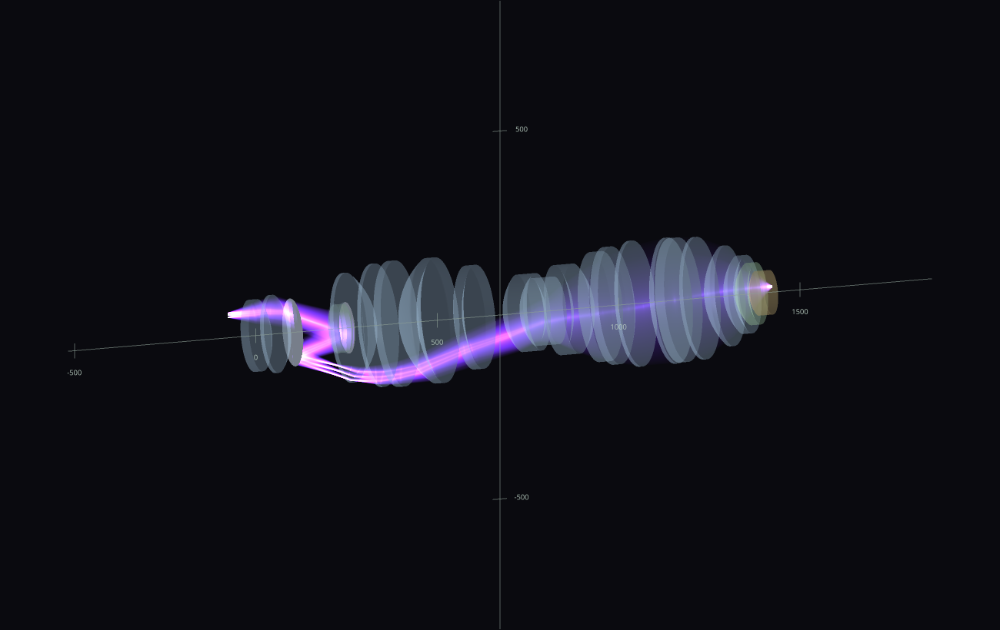

# raytracer

Trazador de rayos óptico en Python: propagación **exacta** (no paraxial) a
través de sistemas definidos por prescripción, análisis de aberraciones de
nivel profesional, y un visor OpenGL con acumulación HDR que hace visible la
estructura del haz.


<sub>Objetivo litográfico DUV de inmersión (US 7,557,996 — 48 superficies, 12
asféricas, NA 1.2, λ=193.368 nm). 363 rayos exactos por tres puntos de campo,
acumulados aditivamente en un framebuffer float: donde se superponen miles de
rayos la intensidad *suma*, y el tone-mapping auto-expuesto revela la
cáustica sin saturar. `python -m examples.lithography.duv_objective_2d`</sub>

---

## El haz, en 3-D

El mismo objetivo, revolucionado y recorrido por un haz denso. Cada rayo
lleva el color espectral de su longitud de onda (CIE 1931 → sRGB lineal)
escalado por su energía; 193 nm es ultravioleta profundo, y se representa
por su violeta correspondiente.



<sub>`python -m examples.lithography.duv_objective_3d --beam` — la tecla **m**
alterna líneas/haz, **a** los ejes, **w** wireframe; arrastra para orbitar.</sub>

Y el caso límite: un **óvalo de Descartes**, la superficie refractante que
Descartes construyó para ser perfectamente estigmática. Todo el haz colapsa
en un punto sin aberración esférica a ninguna apertura.


<sub>RMS del spot: **5.0e-13 µm**. Máx |OPD|: **0 ondas**. No es una
ilustración: el ejemplo lo <em>verifica</em> y lo imprime.
`python -m examples.stigmatic_surfaces.cartesian_oval_refractor_3d --beam`</sub>

---

## Instalación

```bash
pip install -e .          # numpy, scipy, matplotlib
pip install -e ".[gl]"    # + vispy y un backend de ventana, para el visor OpenGL
```

## Cargar una prescripción y analizarla

```python
from pathlib import Path
from raytracer.design import OpticalSystem
from raytracer.propagation import (
    SequentialTracer, FieldPoint, PupilSampling, solve_object_plane, trace_pupil,
)
from raytracer.analysis import spot_data
from raytracer.viz import plots

system = OpticalSystem.from_prescription(
    Path("data/US7557996_Fig3_Table3_prescription.csv")   # 48 superficies
)
tracer = SequentialTracer(system)
solve_object_plane(tracer)          # recupera el plano objeto imponiendo B = 0

pupil = trace_pupil(tracer, FieldPoint(y=62.0), na_object_sine=0.3,
                    sampling=PupilSampling(kind="rings", radial=12, azimuth=72))
print(spot_data(pupil).rms_radius_um)        # 0.087 µm

plots.layout_figure(tracer, fields=[56.0, 62.0, 67.0]).savefig("layout.png")
```


<sub>El trazado sigue el camino catadióptrico plegado: los dos espejos (M1,
M2) devuelven el haz sobre sí mismo antes del grupo de inmersión final.</sub>


<sub>Spots recentrados en el centroide ponderado por área de pupila, con el
primer cero de Airy como referencia. Los tres campos quedan por debajo del
límite de difracción.</sub>

## Superficies estigmáticas

Superficies diseñadas para converger *exactamente*, y verificadas
cuantitativamente en vez de solo dibujadas.

| | |
|---|---|
|  |  |
| **Espejo elíptico** — todo rayo que sale de un foco pasa exactamente por el otro. RMS al foco lejano: **5.1e-13 µm** | **Óvalo de Descartes** (2-D, forma implícita) — refracción aire→vidrio sin aberración esférica. RMS al punto imagen: **3.1e-10 µm** |

La distancia se mide contra la *recta* de cada rayo, no contra una pantalla
física: una pantalla en el foco ocultaría los rayos directos antes de que
lleguen a la superficie.

## Telescopios

Ser afocal no se asume: la separación objetivo–ocular se *resuelve*
numéricamente para que la focal efectiva sea exactamente infinita en el
sistema real de espesor finito, y después se comprueba trazando dos rayos
paralelos y midiendo que salen paralelos.


<sub>**Kepleriano** — objetivo y ocular positivos separados por la suma de
sus focales; se forma una imagen intermedia real (punto verde) donde iría el
retículo. Magnificación angular medida por trazado: **−3.989×**, invertida.</sub>


<sub>**Galileano** — el "anteojo de ópera": ocular *negativo*, imagen derecha
y tubo corto, sin imagen intermedia real. **+4.069×**, derecha.</sub>


<sub>**Newtoniano**: primario parabólico + secundario plano a 45° que pliega
el cono 90° hacia afuera del tubo. El haz de entrada es anular, como en un
telescopio real: la silueta del secundario no lleva luz. RMS al foco plegado:
**1.5e-15**.</sub>

## Arquitectura

El paquete está organizado por la **naturaleza** de cada pieza, no por qué
motor la necesitó primero. Las dependencias forman un DAG estrictamente
descendente, verificado por análisis AST de los imports:

```
math  →  surfaces  →  optics  →  design  →  propagation  →  io  →  analysis  →  viz
```

| paquete | qué es |
|---|---|
| **`math`** | Vectores, transformaciones rígidas, y el solver de intersección rayo/superficie. No sabe nada de óptica. |
| **`surfaces`** | Las superficies. Cada una declara su geometría de forma **implícita** (`f_Σ(x) = 0`) o **paramétrica** (`x = P(t)`); ninguna resuelve su propia intersección. |
| **`optics`** | La luz y sus leyes: `Ray`, `laws` (reflexión/refracción), `radiometry` (Fresnel), materiales, emisores, instrumentos, elementos. |
| **`propagation`** | Los algoritmos: `sequential` (cada rayo por cada superficie en orden, vectorizado) y `branching` (árbol completo de reflexión+refracción). |
| **`design`** | `SurfaceRow`/`OpticalSystem`: el modelo de datos de un sistema, independiente de cualquier motor. |
| **`io`** | Lectura/escritura de prescripciones. |
| **`analysis`** | Spots, ray fans, Zernike ANSI/OSA, frente de onda por eikonal, PSF escalar, imagen de Abbe, verificación de estigmatismo. |
| **`viz`** | Figuras matplotlib y el visor OpenGL HDR. |

### Una sola entrada para intersectar

Un rayo es el conjunto de puntos `A + λu`. Una superficie se describe de una
de dos formas, y cada una da un método para intersectarla:

```
implícito     f_Σ(A + λu) = 0        →  resolver para la menor λ > 0
paramétrico   A + λu = P(t)          →  resolver para la menor λ > 0
```

`intersect_ray_with_surface(rayo, superficie)` es el único punto de entrada:
pregunta a la superficie qué descripción ofrece y aplica el método
correspondiente. Dentro del método implícito el solver toma la ruta exacta
más barata que la superficie permita (forma cerrada si `f_Σ` es cuadrática,
Newton desde una semilla, bracket+bisección si no) — tres formas de resolver
*la misma ecuación*, no tres métodos.

El gradiente implícito hace doble trabajo: es a la vez la derivada de Newton
y la normal de la superficie. Por eso `Surface.hit()` es una única plantilla
genérica en la clase base, y no código repetido en cada superficie.

### Un rayo no detecta sus propias intersecciones

`Ray` es origen + dirección + `point_at()`. Detectar la colisión es la
descripción de la superficie más `math.intersections`; decidir qué pasa
después (reflejar, refractar, detenerse, ramificar) es del algoritmo de
propagación. La genealogía de rayos (`RayNode`/`RayTree`) pertenece al
algoritmo que la crea, no al rayo.

## Ejemplos

```bash
python -m examples.lithography.duv_objective_2d      # objetivo DUV, HDR 2-D
python -m examples.lithography.duv_objective_3d --beam
python -m examples.stigmatic_surfaces.ellipse_mirror
python -m examples.stigmatic_surfaces.cartesian_oval_refractor_2d
python -m examples.stigmatic_surfaces.cartesian_oval_refractor_3d --beam
python -m examples.telescopes.keplerian              # y galilean, newtonian
python -m examples.imaging.single_lens_relay         # matplotlib y OpenGL
python -m examples.imaging.interactive_doublet       # arrastra fuente/lente/pantalla
python -m examples.imaging.geometric_and_diffractive_imaging
```

Cualquiera acepta `--save salida.png` para renderizar sin abrir ventana.
`docs/render_images.py` regenera todas las imágenes de este README.

Los notebooks en `examples/notebooks/` reproducen dos objetivos de patente
completos:

- `us7557996_objective.ipynb` — el DUV de inmersión de arriba: réplica dígito
  a dígito del análisis de referencia.
- `euv_six_mirror.ipynb` — objetivo EUV de seis espejos (US 7,151,592,
  NA 0.22, λ=13.4 nm): validación analítica, refit de asféricas por mínimos
  cuadrados, frente de onda por eikonal, imagen de Abbe y curva de contraste.

## Tests

```bash
pytest                 # suite completa
pytest -m "not gpu"    # sin los smoke tests de OpenGL
```

Las verdades de referencia son analíticas donde existen: conjugados de
parábola y elipsoide a precisión de máquina, magnificación paraxial del
objetivo DUV (+0.2500000135), NA de imagen 1.1977, RMS de Zernike (0.5089 nm
tras quitar tilt y desenfoque), primer cero de Airy, colapso de contraste en
el límite de coherencia parcial, y linealidad aditiva del framebuffer HDR.
Los dos métodos de intersección se contrastan entre sí sobre el óvalo de
Descartes — la única superficie que ofrece ambas descripciones — exigiendo
que caigan en el mismo punto para el mismo rayo.

## Estructura del repositorio

```
raytracer/     el paquete (math, surfaces, optics, propagation, design, io, analysis, viz)
data/          prescripciones de ejemplo en CSV -- son datos, no código
examples/      demos ejecutables por categoría + notebooks de réplica de patentes
docs/          imágenes del README y el script que las regenera
reference/     notebooks y módulo de referencia originales
tests/         verdades analíticas + regresiones de sistema completo
```
