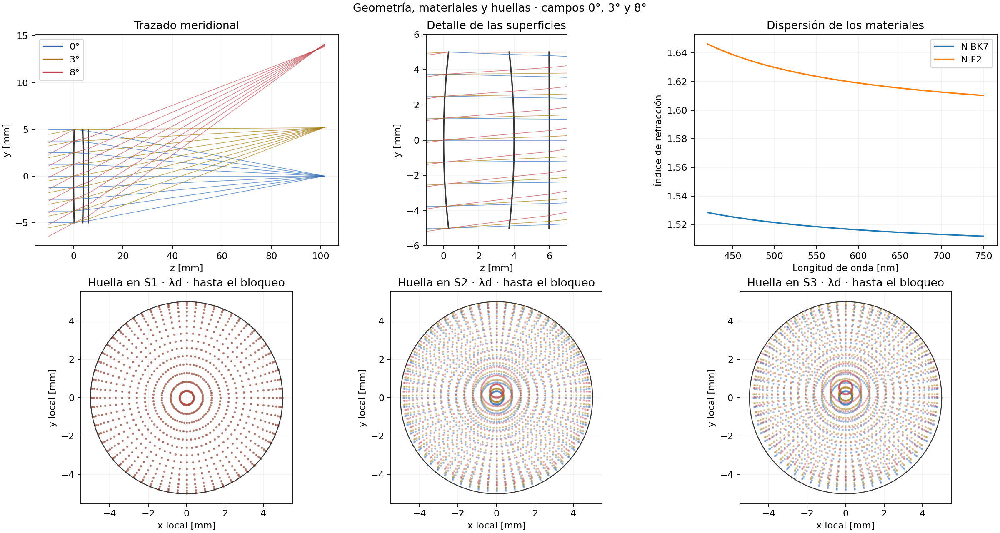
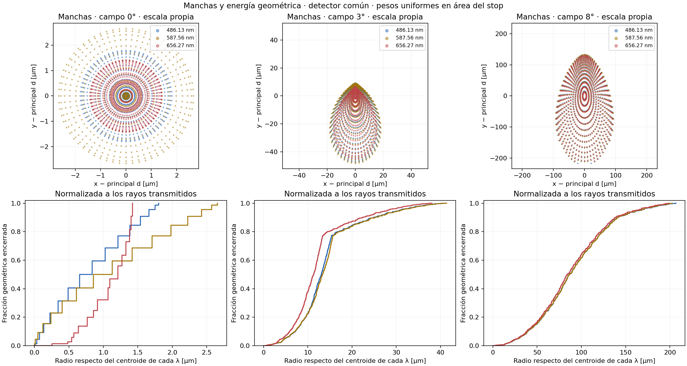
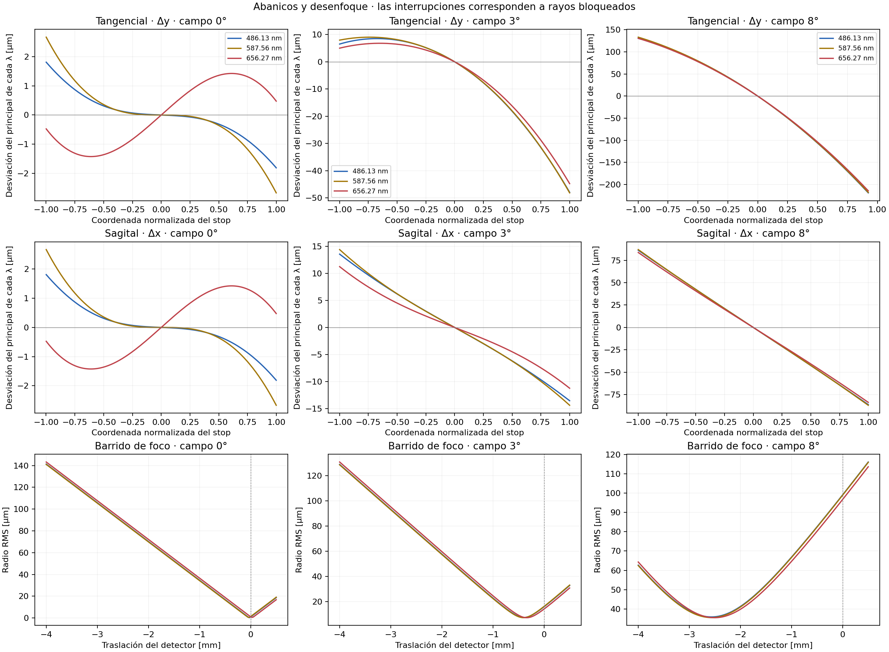
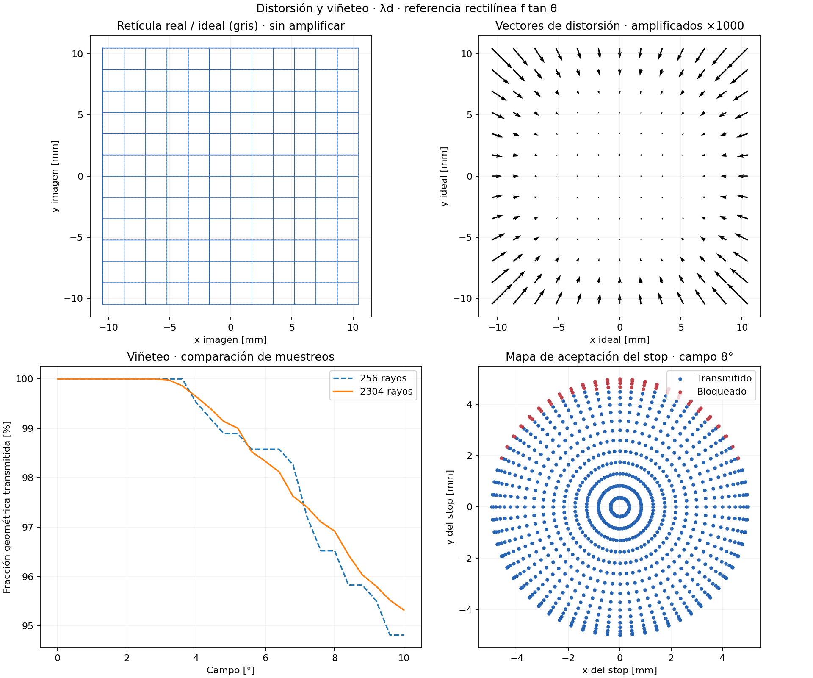
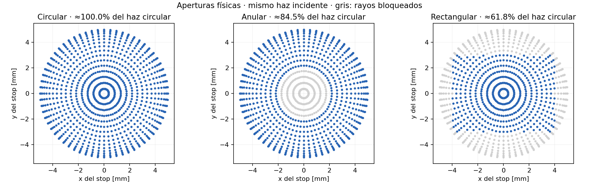
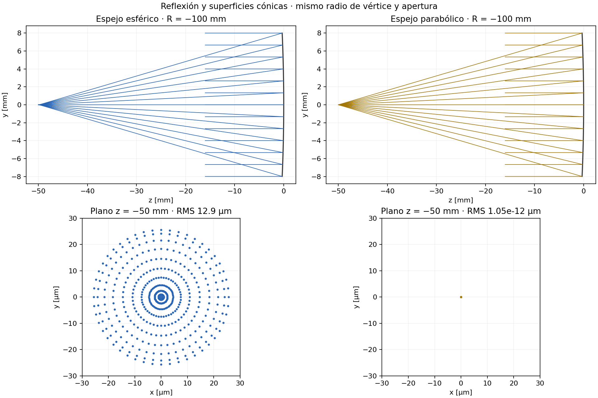
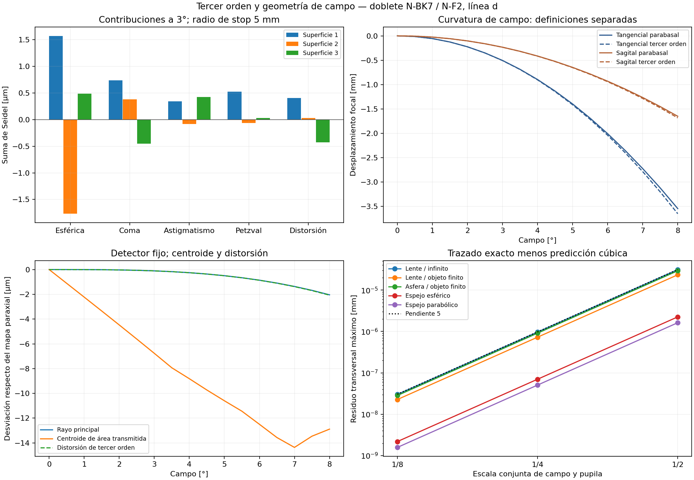

# Galería de óptica geométrica

Esta galería reúne resultados calculados y vistas habituales de análisis. No es
una captura de una interfaz de escritorio integrada. Las figuras `gallery_*`
se regeneran con:

```bash
python -m examples.aberrations.feature_gallery
```

El ejemplo usa un doblete N-BK7/N-F2 de apertura de 10 mm, objeto en infinito,
campos de 0°, 3° y 8° y longitudes de onda F/d/C de 486.13/587.56/656.27 nm.
Todos los colores se evalúan sobre el mismo detector, fijado al foco gaussiano
de la línea d. El diseño procede de ecuaciones de doblete delgado y conserva
aberraciones al introducir espesores; no es un diseño optimizado.

Los resultados numéricos, prescripción y huella de la implementación están en
[feature_gallery_results.json](feature_gallery_results.json).

## 1. Trazado, materiales y huellas



Los rayos se apuntan al stop físico. Las huellas muestran los puntos registrados
en cada superficie hasta el bloqueo; los puntos no se ponderan visualmente por
potencia. La vista general tiene escalas axial y transversal diferentes; el
detalle de las lentes tiene escala geométrica igual.

## 2. Manchas y energía geométrica encerrada



Cada columna tiene su propia escala, indicada en micrómetros. Las manchas usan
como origen el rayo principal de la línea d. Las curvas de energía se centran
en el centroide de cada longitud de onda y se normalizan al flujo transmitido.
Se emplean pesos de cuadratura de área, no un simple recuento de puntos.
Los escalones son muestreo discreto, no estructura física del haz.
No se incluyen pérdidas Fresnel, absorción ni difracción.

## 3. Abanicos de rayos y barrido de foco



Los abanicos se obtienen apuntando coordenadas físicas al stop y trazando los
rayos; su referencia es el principal de cada longitud de onda. Se omiten los
rayos bloqueados. Esta construcción admite objeto en infinito y no utiliza
la interfaz histórica de abanicos basada en aumento de conjugados finitos.

El barrido prolonga rectilíneamente los rayos emergentes a planos paralelos en
el espacio imagen homogéneo. El RMS se calcula respecto del centroide en cada
plano. El mínimo es un foco RMS de apertura finita; no es el foco parabasal.

## 4. Distorsión y viñeteo



La retícula compara rayos principales con la referencia rectilínea paraxial
basada en tangentes de los ángulos. Los vectores amplifican el desplazamiento
1000 veces; la retícula izquierda no lo amplifica. Se usan ángulos componentes
entre −6° y +6°, de modo que las esquinas superan 6° de campo radial.

La comparación de 256 y 2304 rayos permite ver la dependencia del viñeteo con
el muestreo; no constituye una certificación de convergencia. La fracción
transmitida es geométrica para iluminación uniforme del stop.

## 5. Aperturas físicas



Se conserva el mismo haz circular incidente para las tres aperturas: círculo
de radio 5 mm, anillo de radios 2 y 5 mm y rectángulo de 8 × 6 mm. Los porcentajes
son estimaciones de cuadratura. Las razones de área ideales son 100%, 84% y
48/(25π) ≈ 61.12%; la discrepancia de la muestra ilustra la integración de
bordes discontinuos. No confundir con normalizar cada apertura a su propia área.
El stop rectangular se demuestra trazando lanzamientos existentes; el muestreo
automático de stop rectangular todavía no está implementado.

## 6. Reflexión y cónicas



El espejo esférico y el parabólico comparten radio de vértice y apertura. El
paraboloide concentra rayos axiales paralelos en su foco dentro del error
numérico; el espejo esférico conserva aberración esférica. Esto no implica que
el paraboloide esté libre de aberraciones fuera del eje.

## 7. Superficies y rayos tridimensionales

La [nueva vista sólida transparente](solid_viewer.md) añade cuerpos cerrados y
azules según el índice:


La siguiente vista de contornos se conserva como diagnóstico geométrico.


Figura de la etapa de cromática y sensibilidad: inclinación de 0.5°, coordenadas
reales y trazado sobre superficies colocadas en marcos locales.
Se reproduce con `python -m examples.aberrations.chromatic_sensitivity`.

## 8. Seidel, focos parabásales y teoría



Descomposición por superficie, curvatura tangencial/sagital, distorsión del
principal frente al desplazamiento del centroide y convergencia de la
aproximación de tercer orden. Se reproduce con
`python -m examples.aberrations.third_order_validation`.
Véase [la definición y validación de cada magnitud](third_order_validation.md).

## 9. Cromática, sensibilidad y Monte Carlo


Color axial, manchas espectrales, respuesta al descentramiento y 128
realizaciones reproducibles de tolerancias. La distribución RMS usa una
referencia nominal fija e incluye desplazamiento de imagen. No equivale a
rendimiento de fabricación sin un criterio explícito de aceptación.
Véase [condiciones y límites](chromatic_sensitivity.md).

## 10. Comparación independiente y aberración longitudinal


Se reproduce con `python -m examples.aberrations.geometrical_validation`.
Incluye la comparación con 45 rayos independientes de RayOptics y las leyes de
tercer orden del espejo esférico.

## Ejemplos visuales preexistentes

Estas imágenes estaban en el repositorio: muestran otras familias disponibles,
pero **no se regeneraron ni se revalidaron en esta ejecución de la galería**.
Los ejemplos OpenGL requieren contexto gráfico. Su existencia no certifica
que todos los análisis profesionales de esos sistemas estén completos.

### Óvalo cartesiano: refracción entre conjugados finitos


### Espejo elíptico


### Telescopios


### Objetivo de múltiples superficies


El ejemplo DUV es histórico; sus materiales y prescripción tienen limitaciones
de procedencia documentadas. No se presenta como diseño industrial certificado.

## Cobertura y límites

| Capacidad | Evidencia en esta galería | Estado de la vista |
|---|---|---|
| Refracción, reflexión, cónicas | Doblete y comparación de espejos | Recalculada |
| Campos angulares y stop aiming | Manchas, abanicos y huellas | Recalculada |
| Materiales dispersivos | Curvas N-BK7 y N-F2 y tres colores | Recalculada |
| RMS y mejor foco geométrico | Barrido de detector | Recalculada |
| Energía encerrada geométrica | Distribución ponderada de intersecciones | Nueva vista derivada del trazador |
| Distorsión bidimensional | Retícula y vectores de principales | Recalculada |
| Viñeteo y aperturas | Aceptación, dos muestreos, tres formas | Recalculada |
| Marcos 3D, inclinación y descentramiento | Doblete inclinado y sensibilidad | Informe anterior reproducible |
| Seidel por superficie, asféricas pares | Informe y referencias de tercer orden | Validado en los casos documentados |
| Focos T/S, astigmatismo y Petzval | Informe de tercer orden | Validado en sistemas centrados |
| Cromática axial y lateral | Informe cromático y manchas | Informe anterior reproducible |
| Sensibilidad y Monte Carlo | Informe de tolerancias | Informe anterior reproducible |
| Objetos finitos, óvalos y telescopios | Figuras históricas anteriores | No reejecutadas aquí |
| Prescripciones y resultados JSON | Archivo numérico enlazado | Exportado en esta ejecución |
| Trayectoria óptica y segmentos virtuales | Suite esencial y referencia RayOptics | Sin panel específico nuevo |
| Ramificación y radiometría histórica | Módulos existentes | No auditados ni demostrados aquí |
| Interfaz integrada y editor de lentes | — | Pendiente |
| Pupilas de entrada/salida y telecentricidad | — | Análisis profesional pendiente |
| Análisis afocal completo | Solo ejemplos históricos de telescopios | Pendiente |
| Aberraciones generales de sistemas descentrados | Trazado 3D disponible | Teoría/análisis general pendiente |
| Optimización y óptica ondulatoria | — | Fuera del alcance acordado |

La galería demuestra las principales familias geométricas, no afirma haber
probado toda combinación de parámetros ni cada función histórica del repositorio.

## Correspondencia con vistas de software óptico

La documentación de OpticStudio incluye [abanicos de rayos](https://ansyshelp.ansys.com/public/Views/Secured/Zemax/v251/en/OpticStudio_User_Guide/OpticStudio_Help/topics/Ray_Aberration_rays_and_spots.html),
[energía geométrica encerrada](https://ansyshelp.ansys.com/public/Views/Secured/Zemax/v252/en/OpticStudio_User_Guide/OpticStudio_Help/topics/Geometric.html)
y [curvatura de campo y distorsión](https://ansyshelp.ansys.com/public/Views/Secured/Zemax/v26102/en/OpticStudio_User_Guide/OpticStudio_Help/topics/Field_Curvature_and_Distortion.html).
La correspondencia de nombres no implica igualdad de valores: para comparar
hay que igualar prescripción, stop, referencia de imagen, espectro, pesos,
muestreo y convenciones de signo.
