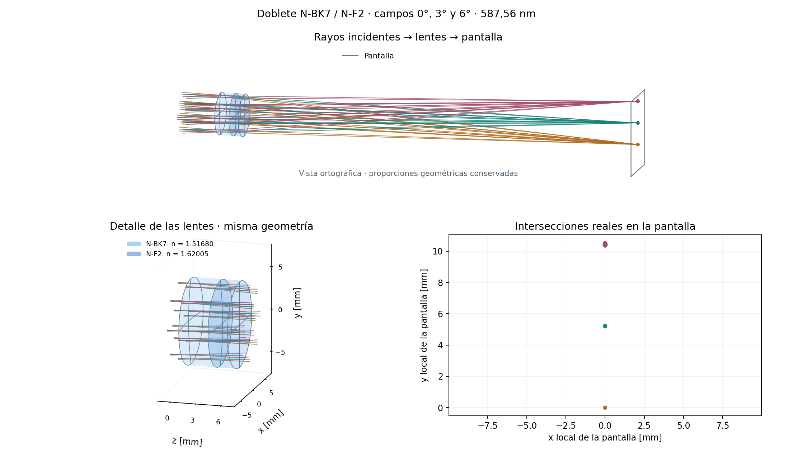

# Geometría 3D en la figura existente de Matplotlib

`raytracer.viz.geometric.layout_3d_figure` conserva su API y añade un argumento
opcional `ray_colors`, con un color por trayectoria. La figura muestra el
recorrido completo, un detalle de las lentes y las intersecciones sobre el
plano detector en sus coordenadas locales. Sigue usando exclusivamente
Matplotlib y NumPy, ya dependencias del proyecto.



```bash
python -m examples.aberrations.matplotlib_layout
```

- Caras y contornos se calculan con el mismo perfil de sag y los mismos marcos
  que utiliza el trazador. El relleno es una triangulación de visualización.
- Se conservan los puntos de lanzamiento y los extremos sobre la pantalla.
  Solamente el detalle de las lentes recorta los segmentos al encuadre mediante
  intersección con su caja de visualización; no modifica las trayectorias.
- La pantalla dibujada incluye todas las intersecciones suministradas. Su borde
  es una extensión visual, no una nueva apertura óptica.
- La escala azul fija depende del índice a la longitud de onda del sistema:
  n=1.45 a n=1.80, con saturación fuera del intervalo y valores en la leyenda.
- Los volúmenes rellenados requieren pares coaxiales de caras refractoras con
  aperturas circulares iguales y sin obstrucción. Se admiten colocaciones rígidas
  del elemento. Si el relleno no está soportado, se conservan los contornos y
  se emite un aviso; no se inventa una geometría mecánica.
- El borde lateral usa la apertura como límite de visualización. El relleno
  alfa de Matplotlib es ilustrativo; no simula absorción ni refracción del fondo.
  El ordenamiento de transparencias de mplot3d tiene limitaciones al rotar.

El ejemplo conserva el doblete original N-BK7/N-F2, su detector y campos de
0°, 3° y 6°. Traza 16 rayos por campo: los 48 llegan a la pantalla. El residuo
máximo entre los puntos de intersección y el perfil analítico es 3.35e-15 mm;
esta cifra verifica coordenadas, no la precisión de la aproximación poligonal.

Se retiraron el visor VTK, su dependencia, sus exportaciones y el ejemplo que
modificaba la posición del stop del Cooke. VisPy vuelve a su implementación
anterior. Se conserva el generador de mallas NumPy, usado ahora por Matplotlib,
y su comprobación geométrica dentro de los diez tests esenciales.
