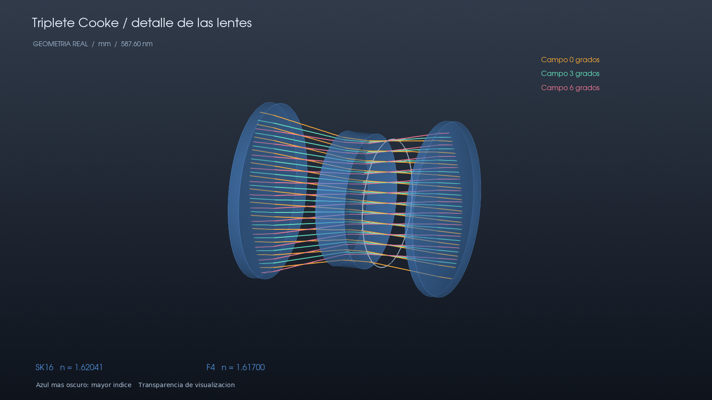
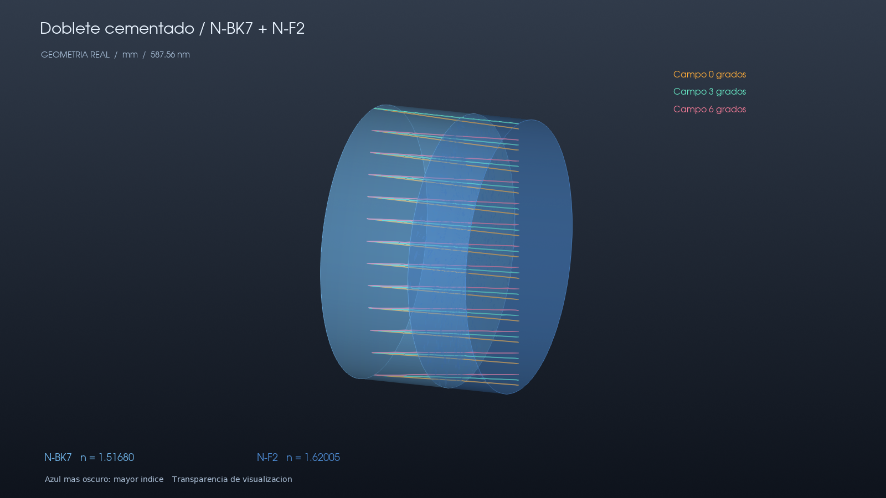
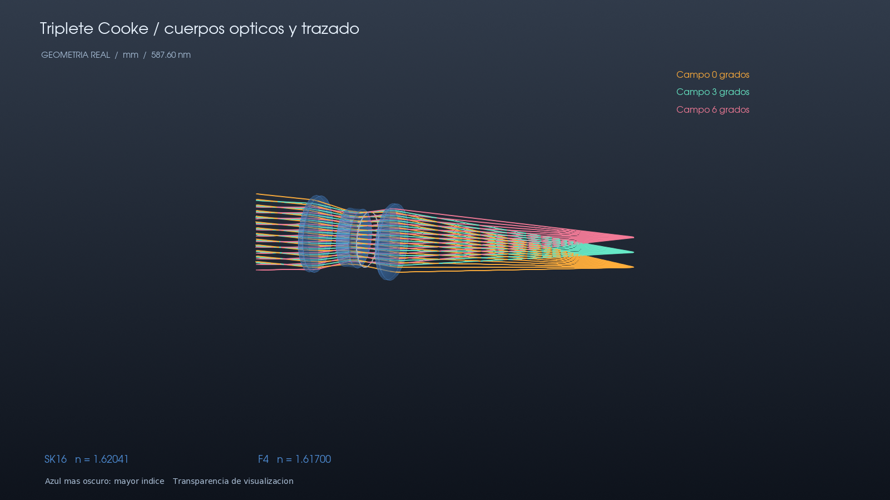

# Lentes sólidas y transparentes

El visor `SolidViewer` representa cada volumen óptico mediante dos caras
muestreadas de sus perfiles reales y un borde lateral cerrado. Las mallas se
construyen en los marcos locales y se transforman a coordenadas globales.
El sombreado, los contornos y la transparencia sirven para leer la geometría;
no modifican los rayos ni representan absorción o una simulación fotográfica
de la refracción del entorno.





## Uso

```bash
pip install '.[solid]'
python -m examples.aberrations.solid_lenses
python -m examples.aberrations.solid_lenses --interactive
```

La opción interactiva abre una ventana nativa con cámara orbital, desplazamiento
y zoom. La exportación PNG usa la misma escena. Requiere un contexto OpenGL;
en esta ejecución se verificó el renderizado EGL sin ventana con VTK 9.7.
La interacción con ratón en una ventana de escritorio no se probó aquí.

```python
from raytracer.viz import SolidViewer

viewer = SolidViewer(system, opacity=0.42)
viewer.add_paths(pupil.batch.paths, color=(1.0, 0.70, 0.27))
viewer.save("system.png")
viewer.show()
viewer.close()
```

## Color y transparencia

- El índice se evalúa a la longitud de onda del sistema, indicada en la imagen.
- La escala fija va de azul claro para n = 1.45 a azul oscuro para n = 1.80.
  Los valores fuera del intervalo saturan; el índice numérico permanece visible.
  No se reescala el color para exagerar diferencias pequeñas entre materiales.
- N-BK7 y N-F2 tienen índices 1.51680 y 1.62005 a 587.56 nm.
- Los materiales SK16/F4 del Cooke histórico tienen índices próximos y, por
  tanto, tonos próximos. Sus aproximaciones de dispersión siguen teniendo las
  limitaciones documentadas en el catálogo; el render no las elimina.
- La transparencia usa *depth peeling* para resolver las capas superpuestas.
  Las tres exportaciones confirmaron que ese procedimiento estaba activo.
- El visor OpenGL anterior también toma ahora el color del índice al añadir
  un sistema. Sus restantes funciones no se migraron a VTK.

## Alcance geométrico

Se admiten pares consecutivos de superficies refractoras coaxiales, con
aperturas circulares iguales y sin obstrucción central; pueden inclinarse o
trasladarse como elemento completo. Los dobletes cementados comparten una
interfaz entre dos volúmenes. Las caras enfrentadas se comprueban en el
muestreo radial para rechazar cruces y dominios de sag inválidos.

El radio de apertura proporciona el borde **de visualización**: no se inventan
monturas, biseles ni dimensiones mecánicas. Los casos que no cumplen las
condiciones anteriores producen un error explicativo. Los espejos y stops
sin volumen se conservan como contornos; su representación sólida está pendiente.
El diagnóstico Matplotlib `layout_3d_figure` sigue disponible como vista de
contornos; el visor sólido es la nueva opción para presentación tridimensional.

## Prescripción del ejemplo

El doblete conserva la prescripción del informe cromático. Para el Cooke de
esta demostración, el stop se desplaza desde z = 9 mm hasta z = 11 mm, dentro
del aire entre la lente central y la posterior. Los vértices de las lentes y
el detector no se desplazan. Esto evita las prolongaciones virtuales requeridas
por el stop de la prescripción histórica. No se modifica el CSV original ni
la referencia independiente utilizada por los tests.

## Verificación

Se mantienen diez tests esenciales. El test de covariancia tridimensional
comprueba además que cada arista de la malla pertenece a dos triángulos,
que no hay triángulos degenerados, que el volumen orientado es positivo y
que una transformación rígida produce los vértices esperados.
La exportación de las tres escenas se ejecutó y revisó visualmente.
